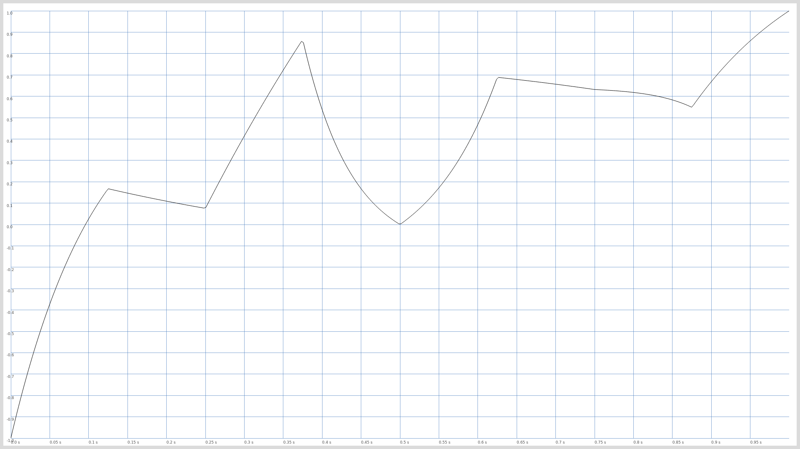
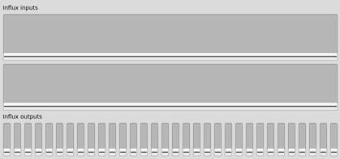
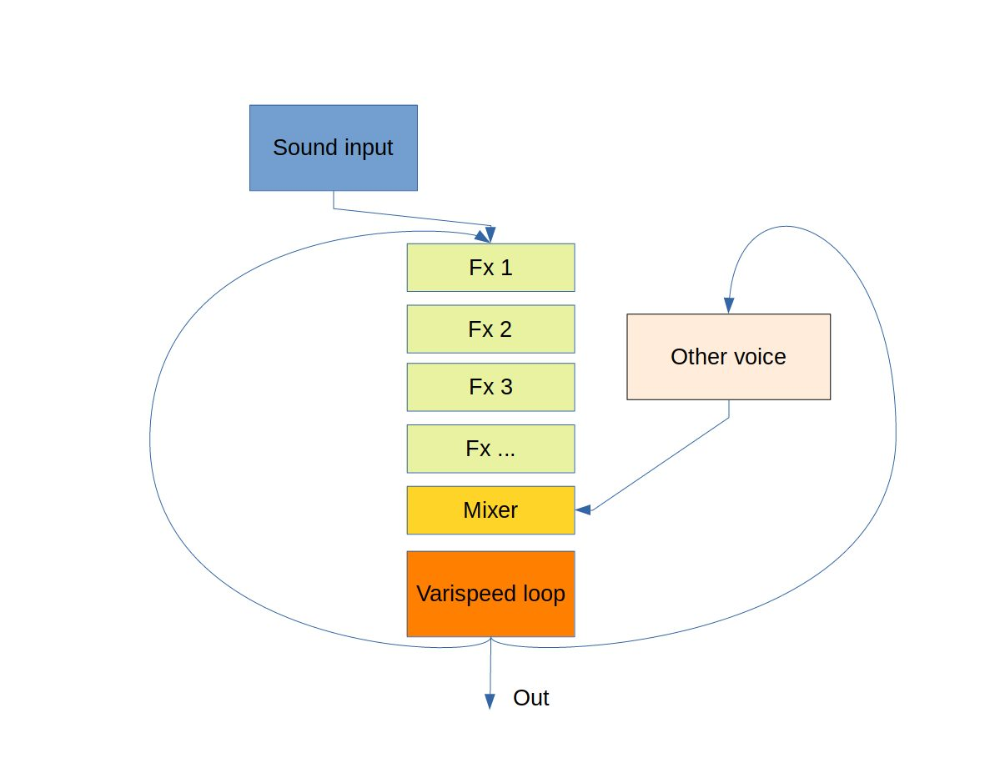

# Vortex

Vortex is a multi modal computer music system by [Mads Kjeldgaard](https://madskjeldgaard.dk).

It is inspired by reel to reel tape recorders, cybernetic and feedback music as well as more contemporary generative systems.

At it's core it has a complex web of sound processes divided in voices, all of them interconnected in feedback paths and outputting their sound to digital looping varispeed tape reels.

The name is meant to illustrate the fact that there is a continuous, turbulent flow and that the sounds and movements of the performer disappear in this fluid motion.

## About this repository

For now, this repository is mostly for documentation purposes and for anyone else to be inspired by.

That said, it is a work in progress and designed specifically for the author's own work flow so please don't expect any support if you mess around with it yourself (but please go ahead and do so). It is organized as a SuperCollider Quark, making it easy to install. 

## VortexFlux: Trajectories and control data warping

In stead of letting input data be mapped directly (but weighted) to outputs, the weighted data is used as pointers in a trajectory alloted to each voice. This means that turning a control from 0.0 to 1.0 will pass through valleys and peaks in a path, sort of like a wavetable index:

Vortex uses a fork of Alberto de Campo's brilliant Influx package for control warping and multiplication. 

The basic idea is to take an input, multiply it by weights and spread it to multiple outputs. This is an extremely powerful idea that can transform a simple input (usually one or two inputs) to many differing outputs.

[This article explains the idea nicely](https://www.3dmin.org/research/open-development-and-design/influx/)

## VortexVoice

A vortex voice contains:
- A sound process:
	- Input from the soundcard
	- An fxchain (organized via Sleet)
	- A time machine (a long, looping buffer recorder playing at variable rate)
	- Outputs going to the soundcard
	- Output going to other voices
	- A mixer for mixing in other voices
- A data process:
	- Simple input controller input
- A trajectory which has multiple usecases:
	- Warps the data output as a sort of wavetable where the data becomes an index in the trajectory
	- An envelope for sound processes
	- A trajectory for musical structures on a stretchable time scale 

### Dynamic fx patching and organization
All effect chains are managed using the [Sleet](https://github.com/madskjeldgaard/sleet) package by the same author.

This both serves as a library for sound effect algorithms and an infrastructure for quickly organizing and changing effects. 
In the case of Vortex, this is done primarily using SuperCollider's [nodeproxy role](http://doc.sccode.org/Reference/NodeProxy_roles.html) feature.

